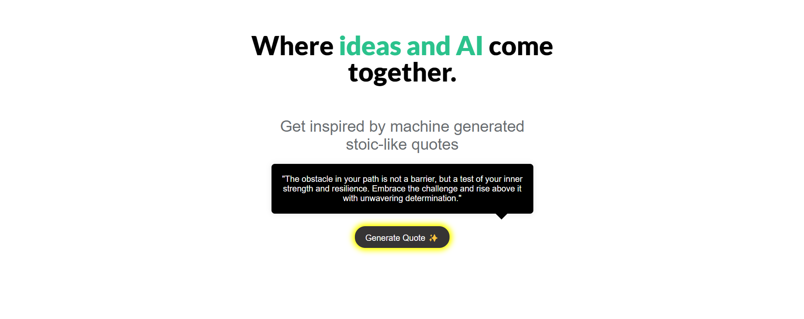

## AI Quote Generator App





This is a Single Page Application (SPA) for generating fake stoic quotes.

This project was created with Express for the backend and vanilla JavaScript for the frontend.


Online Deployment of this project is available [here](https://ai-quotes.onrender.com)


### Getting Started

To get started, you can simply clone the repository and install the dependencies in the root folder.


### Directory Layout and Tree
```text
C:.
│ .env
│ .gitignore
│ app.js
│ package-lock.json
│ package.json
│ README.md
│
├───controllers
│ quoteController.js
│
├───models
│ quoteModel.js
│
├───node_modules
└───views
│ index.html
│ scripts.js
│ styles.css
│
└───elements
quoteElements.js
textElements.js
```

### Application

#### ES6 + Features

- Arrow Functions
- Template Literals
- Destructuring Assignment
- Block-Scoped Variables (Let and Const)
- async await with try/catch
- Spread operator
- Modules export/import

#### Libraries/Frameworks

- **axios**: to make HTTP requests
- **nodejs**: JS runtime for backend
- **express**: server/web framework for nodejs to create server
- **dotenv**: to handle environment variables
- **openai**: to interact with OpenAI API

The application maintains its state through JavaScript and makes API calls to the backend to fetch or post data.

### API Calls

- **Get** - Generate Fake Stoic Quote:
    ```
    GET /api/quote
    ```

### Author

Hanna Melnyk